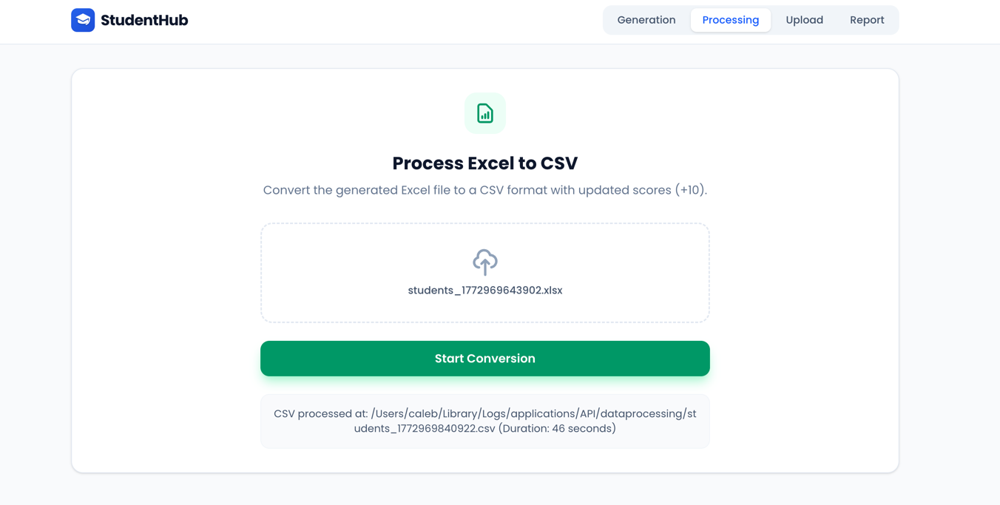
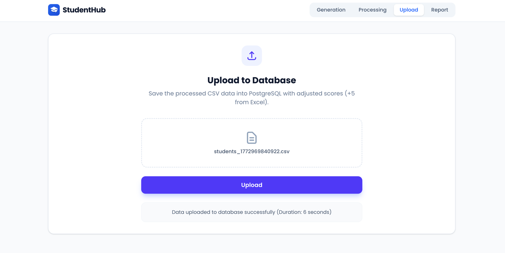
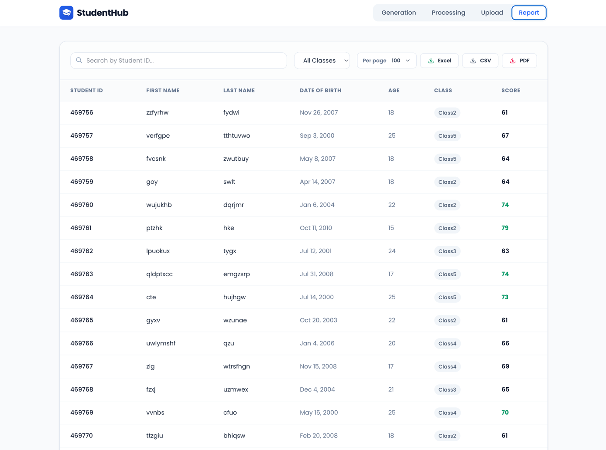

# Student Hub

Student Hub is a full-stack data processing app for generating, transforming, uploading, and reporting on student records at scale.

It combines:
- A Spring Boot backend for data generation, file processing, database upload, and report export.
- An Angular frontend with a tabbed workflow (`Generation -> Processing -> Upload -> Report`).

## What this project does

1. Generate a large `.xlsx` dataset of student records.
2. Process that Excel file into CSV.
3. Upload the CSV into PostgreSQL.
4. Query and export reports as CSV, Excel, or PDF.

## Application stages

### 1. Generation
Creates sample student data in Excel format.


### 2. Processing
Converts the Excel file into CSV.



### 3. Upload
Loads CSV data into the database.



### 4. Report
Displays filtered student records and export options.



## Tech stack

- Backend: Java 21, Spring Boot 3.4.x, Spring Data JPA, PostgreSQL, Apache POI, OpenCSV, OpenPDF
- Frontend: Angular 21, TypeScript, Tailwind CSS
- Build tools: Maven Wrapper, npm

## Repository structure

```text
student-hub/
  backend/   # Spring Boot API
  frontend/  # Angular UI
```

## Prerequisites

- Java 21
- Node.js (current LTS recommended) and npm
- PostgreSQL 14+ (or compatible)

## Backend setup

1. Create the database:

```sql
CREATE DATABASE student_hub;
```

2. Update database credentials in:
`backend/src/main/resources/application.properties`

Current defaults:
- URL: `jdbc:postgresql://localhost:5432/student_hub`
- Username: `postgres`
- Password: empty

3. Start the backend:

```bash
cd backend
./mvnw spring-boot:run
```

The API runs on `http://localhost:8080` by default.

## Frontend setup

1. Install dependencies and start the UI:

```bash
cd frontend
npm install
npm start
```

The UI runs on `http://localhost:4200` by default and calls the backend at `http://localhost:8080/api/students`.

## API overview

Base URL: `http://localhost:8080/api/students`

- `POST /generate?count={n}`  
  Generates an Excel file on disk.
- `POST /process` (multipart `file`)  
  Converts uploaded Excel to CSV on disk.
- `POST /upload` (multipart `file`)  
  Uploads CSV data into PostgreSQL.
- `GET /`  
  Returns paginated students with optional filters:
  - `studentId`
  - `studentClass`
  - standard Spring pageable params (`page`, `size`, `sort`)
- `GET /export/csv`
- `GET /export/excel`
- `GET /export/pdf`  
  Export report files with optional `studentId` and `studentClass` filters.

## Data model

The `students` table maps to:
- `student_id` (primary key)
- `first_name`
- `last_name`
- `dob`
- `student_class`
- `score`

## File output location

Generated/processed files are written to an OS-specific directory from
`backend/src/main/java/com/caleb/student_hub/config/FilePathConfig.java`:

- macOS: `~/Library/Logs/applications/API/dataprocessing/`
- Windows: `C:\var\log\applications\API\dataprocessing\`
- Linux: `/var/log/applications/API/dataprocessing/`

Make sure your user has write permission to the target path.

## Run tests

Backend:

```bash
cd backend
./mvnw test
```

Frontend:

```bash
cd frontend
npm test
```

## Notes

- The backend enables CORS for all origins (`@CrossOrigin(origins = "*")`) in the student controller.
- Large datasets are handled with streaming and batching to reduce memory pressure.
